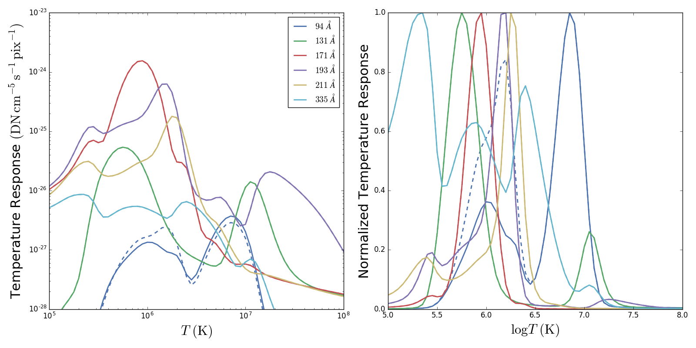

********************************************************************************************************
aia_response: Calculate the *SDO/AIA* temperature response functions with SunPy and ChiantiPy
********************************************************************************************************

**A PDF of these notes is available on the `notes` branch of this repository. Alternatively, you can build the PDF from the reStructured text by running `./build_notes.sh`, provided you've installed `pandoc <http://pandoc.org/>`_.**

Here are some preliminary notes on implementing the AIA response functions with ChiantiPy and SunPy. Currently, the only way to calculate these is with the routines provided in SSW. There is little supporting documentation for these routines.

**GOAL:** Implement AIA temperature response functions using the tools
provided by SunPy and ChiantiPy, providing adequate documentation and benchmarking.

We'll rely primarily on two papers for looking at the AIA response functions:

* `Boerner et al. (2012) <http://adsabs.harvard.edu/abs/2012SoPh..275...41B>`_
* `Boerner et al. (2014) <http://adsabs.harvard.edu/abs/2014SoPh..289.2377B>`_

   SDO/AIA temperature response functions unnormalized (left) and normalized right for the six EUV channels as calculated by the aia_get_response function in SSW. The dashed lines are the response functions calculated with the Chianti correction as discussed in Boerner et al. (2014).

Formalism
##########

For a given position in the image plane :math:`\mathbf{x}` and wavelength channel :math:`i`, the pixel values can be expressed as,

.. math::

    p_i(\mathbf{x})=\int_0^{\infty}\mathrm{d}\lambda\,\eta_i(\lambda)\int_{pixel\,\mathbf{x}}\mathrm{d}\theta\,I(\lambda,\theta)

Here, :math:`\eta_i(\lambda,t,\mathbf{x})` is the efficiency function of the :math:`i^{th}` channel. It can be expressed as,

 .. math::\eta=A_{eff}(\lambda,t)G(\lambda)F(\mathbf{x})

The terms in the above equation are as follows,

* effective area :math:`A_{eff}=A_{geo}R_p(\lambda)R_S(\lambda)T_E(\lambda)T_F(\lambda)D(\lambda,t)Q(\lambda)`
* gain of the CCD-camera system, :math:`G(\lambda)=(12398/\lambda/3.65)g`
* flat field function :math:`F(\mathbf{x})`

According to `Boerner et al. (2012) <http://adsabs.harvard.edu/abs/2012SoPh..275...41B>`_,
the instrument response function is :math:`R(\lambda)=A_{eff}(\lambda,t)G(\lambda)` .
This should not be confused with the *wavelength response function* of `Boerner et al. (2014) <http://adsabs.harvard.edu/abs/2014SoPh..289.2377B>`_
:math:`R_i(\lambda)` which is equivalent to :math:`\eta_i` as expressed above.

With all of that out of the way, we want to calculate the *temperature response function*, for the :math:`i^{th}` channel :math:`K_i(T)` . This can be expressed as,

 .. math::K_i(T)=\int_0^{\infty}\mathrm{d}\lambda\,G(\lambda,T)R_i(\lambda)

Thus, we can calculate the AIA temperature response functions by folding the instrument response function of through the contribution function :math:`G(\lambda,T)` for the appropriate number of spectral lines.

Questions
#########
Some questions about how this will be implemented:

* How will we query the data related to the AIA instrument? (e.g. CCD gain, instrument decay, mirror efficiency, etc.)
* Where does this functionality belong in SunPy?
* What is the best way to get the atomic data from ChiantiPy?
* What amount of time should be spent making contributions to ChiantiPy?

Atomospheric Imaging Assembly (AIA) on SDO
###########################################
`Lemen et al. (2012) <http://adsabs.harvard.edu/abs/2012SoPh..275...17L>`_ provide an in-depth look at the AIA instrument. We will focus on the six EUV channels that AIA uses to image "warm" to "hot" plasma in the solar corona.

CCD Gain
**********
A few notes on the somewhat arbitrary equation for the CCD gain, :math:`G(\lambda)`. First, we note that :math:`G` is said to be measured in DN per photon while :math:`g` is measured in DN per electron. The first factor in the expression is :math:`12398/\lambda`. This is conversion factor for electron volts (eV) per photon. The energy of a photon can be expressed as :math:`E=hc/\lambda`. Expressing Planck's constant in eV gives and the speed of light (perhaps somewhat unconventionally) in angstroms per second gives :math:`hc=(4.135667\times10^{-15}\,\mathrm{eV}\,\mathrm{s})(2.99792458\times10^{18}\,\mathrm{angstrom}\,\mathrm{s}^{-1})\approx12398\,\mathrm{eV}\,\mathrm{angstrom}`.

Similarly, the :math:`1/3.65` is a conversion factor for electrons per eV. It is worth noting that this is stored in the .genx SSW file for each channel under the keyword :code:`ELECPEREV`.

In the expression for :math:`G(\lambda)` in `Boerner et al. (2012) <http://adsabs.harvard.edu/abs/2012SoPh..275...41B>`_, :math:`g` is referred to as the camera gain with units of DN per electron. The third column of Table 6 lists the gain for each camera in units of electron per DN. The numbers from this table are included in the .genx SSW file under the keyword :code:`ELECPERDN`. However, it seems that this field in the data file is not just :math:`1/g` as calculating :math:`G` in this manner gives answers that are close to, but not exactly, the values of :math:`G` found in the second to last row of Table 2 (for the wavelength of the strongest line in each channel).

So the question then is what exactly is :math:`g` and where do we get the information we need to calculate it?

ChiantiPy
##########
ChiantiPy is the Python interface to the CHIANTI atomic database. It provides ways to query atomic data as well as perform calculations with/on the data. The main quantity that we will want to retrieve from CHIANTI/ChiantiPy is the *contribution function* :math:`G(\lambda,T)`.

Calculations
***************
See `Mason and Fossi (1994) <http://adsabs.harvard.edu/abs/1994A%26ARv...6..123M>`_. This will serve as a brief summary for the context of the contribution function :math:`G(\lambda,T)`, and its role in the calculation of the intensity :math:`I_{\lambda}` and the emission measure :math:`\mathrm{EM}(T)` (or differential emission measure :math:`\mathrm{DEM}(T)`).

Consider the case of *bound-bound emission*, where an atom of charge state :math:`+m` (i.e. has been stripped of :math:`m` electrons) in an excited state decays to a lower energy state and emits a photon of energy :math:`\Delta E_{i,j}=h\nu_{i,j}=hc/\lambda_{i,j}`. The emissivity can be expressed as,

 .. math:: P_{i,j}=N_j(X^{+m})A_{j,i}\frac{hc}{\lambda_{i,j}},

where :math:`A_{j,i}` is the Einstein spontaneous emission coefficient, :math:`N_j(X^{+m})` is the number density of the atoms in excited state :math:`j` in charge state :math:`+m` which can itself be expressed as,

 .. math:: N_j(X^{+m}) = \frac{N_j(X^{+m})}{N(X^{+m})}\frac{N(X^{+m})}{N(X)}\frac{N(X)}{N(H)}\frac{N(H)}{N_e}N_e.

The first ratio is population of level j relative total number density of :math:`+m` ions. The second ratio is the *ionization state* of the plasma and is predominantly a function of temperature. The third ratio is the relative abundance of element :math:`X` to hydrogen. The fourth ratio is the relative hydrogen abundance and can be approximated as :math:`\sim0.83`. Finally, the last term is the electron density.

We then use the *coronal model approximation* (which says that all transitions occur between excited state :math:`j` and ground state :math:`g` and that excitation occurs only via collisions and de-excitation only through radiative decay) to express the first ratio,

 .. math:: N_g(X^{+m})N_eC^e_{g,j} = N_j(X^{+m})A_{j,g}.

Plugging this into the emissivity equation,

 .. math:: P_{g,j}(\lambda) = 0.83\mathrm{Ab}(X)G(T,\lambda_{g,j})N_e^2\frac{hc}{\lambda_{g,j}}.

The third term here is the contribution function we've been looking for,

 .. math:: G(T,\lambda_{g,j}) = \frac{N(X^{+m})}{N(X)}C^e_{g,j}.

Essentially, this tells us how much a particular transition :math:`\lambda_{g,j}` contributes to the emissivity at a given temperature :math:`T`. :math:`G(T,\lambda_{g,j})` is strongly peaked in temperature because of the population fraction :math:`N(X^{+m})/N(X)`.

Improvements to Codebase
**************************
Interactions with SunPy
************************
SunPy
######
Mostly SunPy will serve to store the routines. Use AstroPy units to be compliant with the rest of SunPy/AstroPy. Thus far, the directory structure relevant to our project looks like::

	sunpy/
	|___sunpy/
		|___...
			instr/
			|___...
				aia/
				|___aiaprep.py
					response.py

So now there are multiple routines inside of the aia/ directory. At some point, we may want to make the response functions more general so that they can be used by other instruments as well.

Application
############
Some notes about the practical applications of this project, i.e. "How are we going to do this?"

IDL
####
Some notes on the actual IDL routines and what they do.

Meeting Notes
##############
2 May 2016
***********
16 May 2016
************
27 June 2016
*************

* Separate genx file reader from everything else
* All instrument/channel information should be read into an Astropy table
* Distinction between channel and wavelength, one is discrete, the other continuous
* Make sure that every part of the class is agnostic to the way the data is read in
* Constructure takes in a list of channels and thats all, checks them
